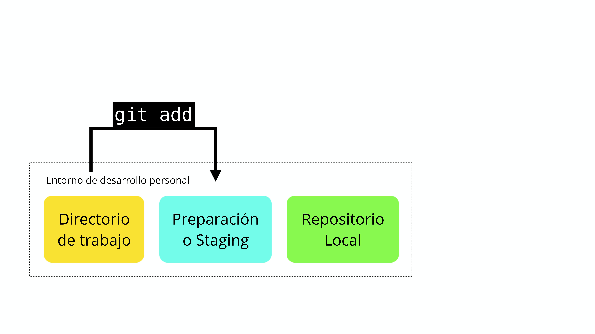
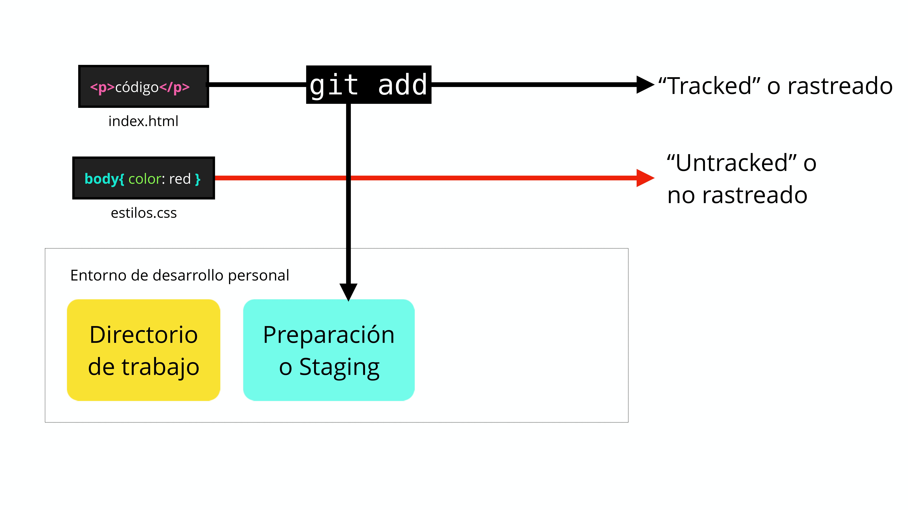

[](https://github.com/eliana1115/Git-y-GitHub-des-cero/tree/main/01_Fundamentos_Git)
# Git-y-GitHub-desde-cero

# 🧩 07 - Resumen avanzado de Git y GitHub

En esta unidad final agrupamos conceptos esenciales y avanzados que complementan tu dominio de Git y GitHub. Recomendado para repasar, profundizar y consolidar tu aprendizaje.

---

## 💾 ¿Por qué usar un sistema de control de versiones como Git?

- Guarda el historial de cambios de forma **atómica e incremental**.
- Facilita el trabajo en equipo y la recuperación de versiones.
- Optimiza el flujo de trabajo mediante ramas, staging y commits.


### Principales comandos:
- `git init` → iniciar repositorio
- `git add` → agregar cambios al staging area
- `git commit -m "mensaje"` → confirmar cambios
- `git commit -am "mensaje"` → atajo para add + commit
- `git push` → subir cambios al servidor remoto

---

## 🧰 Instalación de Git



### Windows:
1. Descargar desde https://git-scm.com/downloads
2. Durante instalación:
   - Elegir Git Bash
   - Usar configuración UNIX para compatibilidad
   - MinTTY, OpenSSL, TrueType

### macOS:
- Usar Terminal (nativa en macOS)
- Descargar Git desde https://git-scm.com

### Linux:
```bash
sudo apt update && sudo apt upgrade
sudo apt install git
```
Verificar instalación:
```bash
git --version
```

---

## 💻 Introducción a la terminal y comandos básicos

| Comando | Función |
|--------|--------|
| `pwd` | Mostrar ruta actual |
| `mkdir carpeta` | Crear carpeta |
| `touch archivo.txt` | Crear archivo |
| `ls`, `ls -a`, `ls -l` | Listar archivos |
| `cd` | Navegar entre carpetas |
| `rm archivo` | Eliminar archivo |
| `cat archivo` | Ver contenido |
| `clear` | Limpiar pantalla |

---

## 🔁 Ciclo de vida de los archivos en Git

 


1. **Untracked** → No rastreados aún por Git
2. **Unstaged** → Rastreado pero con cambios sin añadir
3. **Staged** → Cambios agregados con `git add`
4. **Tracked** → Cambios confirmados con `git commit`

---

## 🌿 Ramas (branches) y merges


- Crear nueva rama: `git checkout -b nueva-rama`
- Moverse entre ramas: `git checkout rama`
- Unir ramas: `git merge rama-secundaria`

---

## ⚔️ Conflictos y soluciones

Git muestra conflictos con marcas:
```
<<<<<<< HEAD
código en main
=======
código en rama
>>>>>>> rama
```

---

## 🔗 Repositorios remotos y GitHub


### Comandos clave:
- `git clone URL` → copiar un repo
- `git remote add origin URL` → vincular
- `git push` / `git pull` → subir y bajar cambios
- `git fetch` + `git merge` = `git pull`


---

## 🧪 Comandos útiles adicionales
- `git stash` → guardar cambios temporalmente
- `git reset --soft` / `--hard` → volver en el tiempo
- `git cherry-pick id` → traer un commit puntual
- `git commit --amend` → modificar último commit

---

✅ Este módulo condensa lo aprendido y te da herramientas para casos reales. ¡Usalo como referencia siempre que lo necesites!
